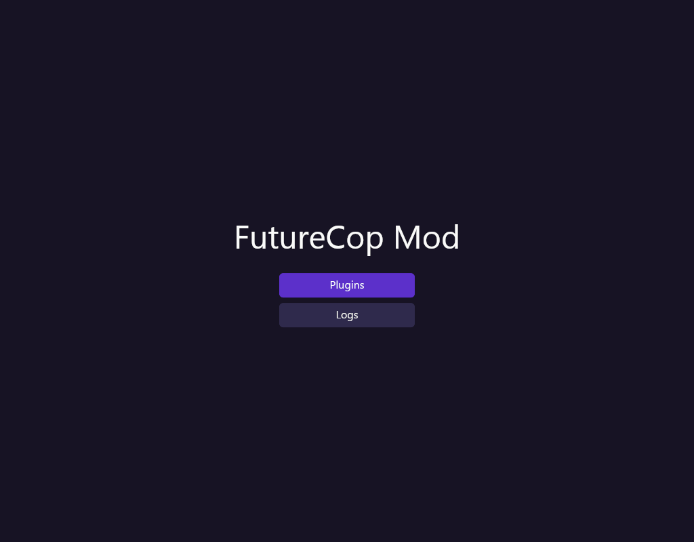
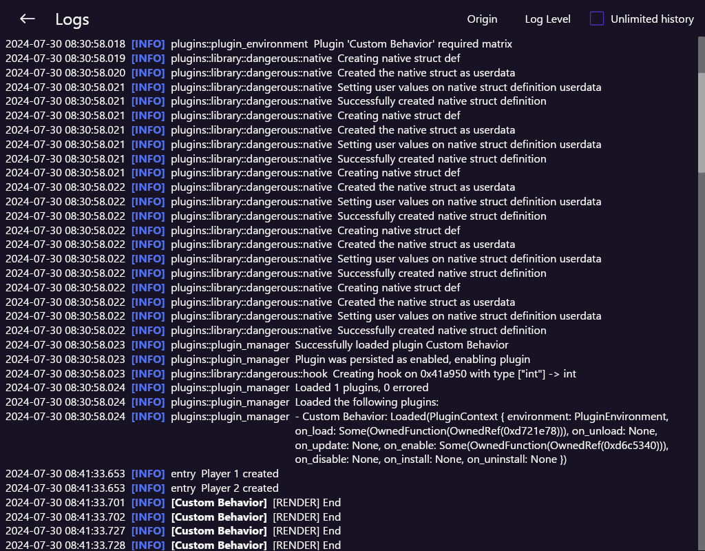

# FutureMod
Modding framework and manager for **Future Cop: LAPD**.

FutureMod lets you manage plugins to extend and change the game, as well as write your own mods, called _plugins_, in Lua using FutureMod's modding framework.
The modding frameworks allows plugins to interact with Future Cop's code and even changing Future Cop's code entirely.
For some identified functions and internal game processes, FutureMod offers an API that allows plugins to easily add their own functionality.
Even if FutureMod doesn't offer a custom API, it allows plugins to hook any arbitrary function and interact with the native assembly code.

_FutureMod is the result of my efforts to reverse engineer **Future Cop**._
_When I discover new functions or how the game works, I'm trying to add these functionalities to the plugin API._
_I'm documenting my findings and some of the development process of FutureMod on my [blog](https://blog.simonkurz.de/post/modding-futurecop-introduction/)._

## Install
For now, you have to manually clone this repository and build FutureMod yourself.

As FutureMod is built with [Rust](https://www.rust-lang.org/), you have to install rust beforehand.
You can install Rust be following their [official guide](https://www.rust-lang.org/learn/get-started).

Install FutureMod by running the following commands:
```bash
# Clone the repository
git clone https://github.com/Ratsch0k/futuremod

# Build FutureMod
cargo build --release
```
After FutureMod was build successfully, its executable should be at `<repository>/target/i686-pc-windows-msvc/release/futurecop-mod-injector.exe`.

If you move the executable, make sure to also move the file `futurecop_mod.dll` (located in the same folder as the executable) alongside because it is required by FutureMod.
However, you don't have to move the DLL.
By default, FutureMod expects the DLL to be in the same directory.
If it isn't, it prompts you to manually select the path to the DLL.
You can permanently change the path where FutureMod expects the DLL by adjusting the field `modPath` in the FutureMod's config file.

FutureMod automatically creates the config file the first time you start it or if it cannot find the config file.
The config file is in the same directory as FutureMod and called `config.json`.

## Usage
To use FutureMod simply run `futurecop-mod-injector.exe` before or after you started the game.
When FutureMod was able to successfully inject into the game it presents with the following overview.


### Installing a new Plugin
Plugins must be packed into a zip before they can be install.
Install a plugin zip file by going to **Plugins** and click **Install Plugin** at the top right.


Then select the plugin zip file.
The GUI will then show some information about plugin and prompts you to accept the installation.

### Viewing Logs
FutureMod as well as plugins can log information.
The GUI allows you to see these logs by clicking on **Logs**.

In the log view you can see the time, log level, message, and the component that logged the message.
For an easier overview, you can also filter messages.
You can filter for specific log levels and for logs from only system (modding framework) or specific plugins.


## Project Structure
FutureMod consists of two parts: the GUI/injector and the mod.

When the user starts the GUI, it waits for Future Cop to start.
When Future Cop runs, the GUI injects the mod into Future Cop and waits for the mod to initialize itself.
The mod hooks itself into the game, initializes the internal plugin manager, loads and enables installed plugins, and starts a local webserver.
When the mod finishes initializing, the GUI connects to the mod's webserver and now acts as the plugin manager.

FutureMod is written in Rust and consists of three packages:
- `futurecop_injector`: The FutureMod GUI. Injects `futurecop_mod` and allows users to interact with it.
- `futurecop_mod`: The actual mod that is injected into Future Cop to run plugins
- `futurecop_data`: Data and code shared by both `futurecop_injector` and `futurecop_mod`

### GUI/Injector
The GUI powered by [iced](https://iced.rs/) using a partially custom theme.
It consists of several mostly independent views.
Each view is located in the `views` directory at `futurecop_injector/src/view`.

### Mod
The mod manages plugins, the plugin API that allows plugins to interact with Future Cop, and sets up a local webserver that the GUI can connect to.
The mod injects itself into some of the game's logic and processes.
However, all modifications are done in memory, and all game files are left untouched.

All code for managing plugin's is located at `futurecop_mod/src/plugins`.
The API is split into several libraries, each responsible for their own category of interaction.
The code for the API libraries is located at `futurecop_mod/src/plugins/library`.

Lua plugins are powered by [mlua](https://github.com/mlua-rs/mlua) with _Luau_ support.

## Modding Framework
The modding framework allows users to install and manage plugins that extend and change Future Cop.
It provides plugins with an API that allows them to interact with the game in various ways.

Plugins are written in [Lua](https://www.lua.org/).
[Luau](https://luau-lang.org/getting-started) is supported, thus, plugin's can use types to improve the developer experience.

As executing arbitrary code is always associated with a potential security risk, the modding framework tries alleviate most of the risk by running all plugins in an isolated sandboxed environment.
A plugin cannot interact with any other plugin and only has access to a few selected default globals.
They can also require on a selection of safe default libraries.
Every plugin gets its own instances of globals and libraries.
The modding framework also offers an API, split among various libraries, that plugins can use to interact with the game.
For example, plugins can use the _UI_ library to show text on screen or the _Dangerous_ library for low-level access to the game, such as function hooking and reading memory.

To use a library, the game must specify its library dependencies in its [manifest file](#manifest).
When a user wants to install a plugin, they are shown information about the plugin, such as its dependencies.

As the modding framework allows plugins to directly interact with the games code, it cannot guarantee the security of plugins.
Therefore, specific libraries are marked as dangerous and if the user installs a plugin that depends on such a library the plugin manager will warn them.

### Example
There are some example plugins in `futurecop_mod/examples/` that show how you could write your own plugins.
The most complex example is the example plugin **Custom Behavior**, which implements a completely custom actor/behavior that the player can interact with to heal themselves.
The plugin makes heavy use of the _dangerous_ library to hook itself into the game's actor system and write and read from the game's memory.
Moreover, it also shows how you can render 3D object.

### Plugin Structure
A plugin consists of at least two files.
The _manifest_ file contains general information about the plugin, and the _main_ file is the plugin's entry point.

#### Manifest
The manifest file contains general information about the plugin.
It must be in the plugin's root directory, is called `info.toml`, and uses the [TOML](https://toml.io/en/) format.

It contains the following information:
- name
- author
- version
- description
- dependencies

The following is an example manifest file of a plugin called _FPS Display_.
```toml
name = "FPS Display"
version = "0.1.0"
authors = ["Simon Kurz"]
dependencies = ["ui", "system", "math"]
description = "Simple FPS display using the UI library."
```

#### Main File
The main file is the entry point for the plugin and is loaded by the modding framework when the plugin is installed.
It must be located in the plugin's root directory and is called `main.lua` (you can also use the ending `.luau`).

A plugin can define several specific functions that are then called by the modding framework depending on specific plugin or game events.
For example, a plugin can define the function `onUpdate`, which is called every frame when playing a mission.
The following functions are available:
- `onUpdate()`: Called every frame while in a mission
- `onLoad()`: Called when the modding framework loads the plugin
- `onUnload()`: Called the plugin is unloaded
- `onEnable()`: Called when the user enables the plugin
- `onDisable()`: Called when the user disables the plugin
- `onInstall()`: Called when the user installed the plugin. As long as the mod is not uninstalled, this function is only called once
- `onUninstall()`: Called when the user uninstalls the plugin

### API
**Index**
- [Game](#game)
- [Input](#input)
- [Matrix](#matrix)
- [System](#system)
- [UI](#ui)
- [Dangerous](#dangerous)

#### Globals
The following globals are available:
- assert
- error
- getmetatable
- ipairs
- next
- pairs
- pcall
- rawequal
- rawget
- rawlen
- rawset
- setmetatable
- select
- tonumber
- tostring
- type
- xpcall

Read about these globals in the official [Lua documentation](https://www.lua.org/manual/5.1/manual.html#5.1).

#### Game
Retrieve information about the current game state such as the mission or players.

##### `getState()`
Returns the current game state.
The game state is read-only.
The following fields are available.
```luau
{
  isInMission: boolean,
  playerCount: number,
  gameMode: "PrecinctAssault" | "CrimeWar"
}
```

#### `getPlayer(player: number)`
Returns information about the specified player.
The argument `player` can either be 0 for the first player or 1 for the second player.
Fields can be modified to modify the player.

The returned userdata contains the following information:
```luau
{
  health: number,
  positionX: number,
  positionY: number,
  positionZ: number,
  idleTimer: number,
  enemiesKilled: number,
  deaths: number,
  currentAction: number,
  movementMode: number,
  currentTargetType: number,
  currentTarget: number,
  lastTarget: number,
  gunWeaponTimeout: number,
  heavyWeaponTimeout,
  specialWeaponTimeout: number,
  gunWeaponAmmo: number,
  heavyWeaponAmmo: number,
  specialWeaponAmmo: number,
  selectedGunWeapon: number,
  selectedHeavyWeapon: number,
  selectedSpecialWeapon: number,
  playerNumber: number,
  accelerationX: number,
  accelerationY: number,
  accelerationZ: number,
  getMaxHealth: () -> number,
}
```

### Input
Basic input processing.

#### `isKeyPressed(key: string): boolean`
Check if the specified key is pressed.
The key must be specified as a string in the format `"Key"` + the key name.
However, the library also exposes all supported keys as values.
For example, to check if the space key is pressed you can either call `input.isKeyPressed("KeySpace")` or `input.isKeyPressed(input.KeySpace)`.

The following list of keys are supported:
- KeyKey0
- KeyKey1
- KeyKey2
- KeyKey3
- KeyKey4
- KeyKey5
- KeyKey6
- KeyKey7
- KeyKey8
- KeyKey9
- KeyA
- KeyB
- KeyC
- KeyD
- KeyE
- KeyF
- KeyG
- KeyH
- KeyI
- KeyJ
- KeyK
- KeyL
- KeyM
- KeyN
- KeyO
- KeyP
- KeyQ
- KeyR
- KeyS
- KeyT
- KeyU
- KeyV
- KeyW
- KeyX
- KeyY
- KeyZ
- KeyF1
- KeyF2
- KeyF3
- KeyF4
- KeyF5
- KeyF6
- KeyF7
- KeyF8
- KeyF9
- KeyF10
- KeyF11
- KeyF12
- KeyEscape
- KeySpace
- KeyLControl
- KeyRControl
- KeyLShift
- KeyRShift
- KeyLAlt
- KeyRAlt
- KeyCommand
- KeyLOption
- KeyROption
- KeyLMeta
- KeyRMeta
- KeyEnter
- KeyUp
- KeyDown
- KeyLeft
- KeyRight
- KeyBackspace
- KeyCapsLock
- KeyTab
- KeyHome
- KeyEnd
- KeyPageUp
- KeyPageDown
- KeyInsert
- KeyDelete
- KeyNumpad0
- KeyNumpad1
- KeyNumpad2
- KeyNumpad3
- KeyNumpad4
- KeyNumpad5
- KeyNumpad6
- KeyNumpad7
- KeyNumpad8
- KeyNumpad9
- KeyNumpadSubtract
- KeyNumpadAdd
- KeyNumpadDivide
- KeyNumpadMultiply
- KeyGrave
- KeyMinus
- KeyEqual
- KeyLeftBracket
- KeyRightBracket
- KeyBackSlash
- KeySemicolon
- KeyApostrophe
- KeyComma
- KeyDot
- KeySlash

### Matrix
Provides integer-based and float-based matrices of any sizes and a special matrix that should be used to create the model matrix of a 3D model.

#### `newInt(data: table): Matrix<integer>`
Create a new dynamic integer matrix from the row-major data.
For example, to create the following matrix
```
1 2 3
4 5 6
```
You would have to call this function as follows:
```lua
matrix.newInt({
  {1, 2, 3},
  {4, 5, 6},
})
```

Any dimensions are allowed.
However, you have to ensure that every row has the same length.

#### `newFloat(data: table): Matrix<number>`
The same as `newInt()` but for a number (float) matrix.

#### Identify and Zero matrix
To create an identify matrix and a zero matrix for float and integer matrices of any size you can use one of the following functions:
- `identityInt(nrows: integer, ncols: integer): Matrix<integer>`
- `identityFloat(nrows: integer, ncols: integer): Matrix<number>`
- `zerosInt(nrows: integer, ncols: integer): Matrix<integer>`
- `zerosFloat(nrows: integer, ncols: integer): Matrix<integer>`

#### `Matrix<T>`
A matrix of any dimension with the data type `T`.
For now, matrices only support the following selected amount of operations:
- `at(row: integer, col: integer): T`: Get the value at matrix[row, col]
- `set(row: integer, col: integer, value: T)`: Set the value at matrix[row, col]
- `__add(...)`: Implements addition of two matrices
- `__mul(...)`: Implements multiplication of two matrices

This type implements `toBytes` and `fromBytes` allowing you to use it with a native struct definition.

It also has the following fields:
- `nrows`: Amount of rows
- `ncols`: Amount of columns

#### `newModel(): ModelMatrix`
Constructs a special type of matrix that is used to represent the scale, rotation, and position of a 3D object.
In addition, when written to memory, this matrix uses the same memory layout as Future Cop.

Internally, this matrix uses floats.
However, Future Cop actually uses integers for its model matrices.
Thus, when converting the matrix into its byte representation all values are cast to integer beforehand.
This might lead to unexpected behavior.

#### ModelMatrix
The matrix supports more operation:
- `at(row: integer, col: integer): T`: Get the value at matrix[row, col]
- `set(row: integer, col: integer, value: T)`: Set the value at matrix[row, col]
- `__add(...)`: Implements addition of two matrices
- `__mul(...)`: Implements multiplication of two matrices
- `translate(x: number, y: number, z: number)`: Translates the matrix according to vector
- `scale(x: number, y: number, z: number)`: Non-uniform scale
- `uniformScale(scaling: number)`: Uniformly scale by `scaling`
- `rotate(x: number, y: number, z: number, angle: number)`: Rotate along the axis specified with x, y, z for the specified angle (in radians)

### System
System-related functions.

#### `getTime(): number`
Returns the amount of time as a unix timestamp in milliseconds.

### UI
UI-related functions such as rendering text to the screen.

#### `renderText(text: string, x: number, y: number, palette: number)`
Renders the given text at the specified coordinates to the screen in the current frame.
The text is colored based on the specified palette.

#### Palettes
The following palettes are available:
- `PaletteBlack`
- `PaletteLightGreen`
- `PaletteLightRed`
- `PaletteLightBlue`
- `PaletteGray`
- `PaletteRed`
- `PaletteGreen`
- `PaletteBlue`
- `PaletteWhite`
- `PaletteYellow`
- `PalettePink`
- `PaletteSkyBlue`
- `PaletteAmber`
- `PalettePurple`
- `PaletteSeal`
- `PaletteDarkGray`

#### `renderRectangle(color: {red: number, green: number, blue: number}, x: number, y: number, width: number, height: number, semiTransparent: boolean)`
Renders a rectangle to the screen in the current frame.
The color must be a table containing the color's red, green, and blue values.

The parameter `semiTransparent` specifies whether the rectangle should be slightly see-through.
However, this behavior is somewhat inconsistent and not fully analyzed.

### Dangerous
Unsafe functions that allow low-level access/modification of the game.
_I will most likely rename this library to **internals** in the future as its more accurate._

Functions that allow for access or modification of memory require the plugin to specify the exact type.
The function uses the specify type to cast the memory address or the provided lua value into the correct type.
The type must be provided as a string and must be one of the following values:
- `"string"`
- `"int"`
- `"uint"`
- `"float"`
- `"void"`
- `"short"`
- `"ushort"`
- `"byte"`
- `"ubyte"`

#### Complex Types
In some special cases, complex types are also supported and can even be implemented fully in Lua (at least, it should be possible. I have not tested it yet.)
Complex types must implement three functions that specify the expected size in bytes of the type in memory, and allow for converting to and from an array of byte values.
They must implement the following methods.

##### `Type:getBytes(): number`
Must return the memory size of the type in bytes.

##### `Type.toBytes(self: Type, instance: any): {[number]: number}`
Must convert `instance` into an array of bytes.
The array of bytes is then written to memory.

_Note, the method receives to arguments._
_The first argument is a reference to the type itself and the second argument is the instance of the type that should actually be converted into the byte array._
_This approach allows you to implement custom types that are purely meant for conversion or for more than one conversion of the same type._
_This is useful if for types where the actual instance would allocate some memory and when defining native structs with `createNativeStructDefinition(...)`._
_For example, there are two matrix types: `Matrix<T>` and `MatrixType<T>`._
_You can use `MatrixType` to convert any matrix of the same type to bytes._

#### `Type.fromBytes(self: Type, bytes: {[number]: number}): any`
Creates an instance of a type from the given byte array.
The returned instance doesn't have to be of type `Type`.
_This allows for the same flexibility as explained above in `toBytes(...)`.

#### `readMemory(address: integer, type: string): T`
Reads the memory at `address` and returns it as a value of the specified type.
_Complex types are not supported (this is planned)._

#### `writeMemory(address: integer, value: T)`
Write the `value` to the specified address.
The value is automatically converted to bytes depending on the type.
The value can also be a complex type.

#### `hook(address: number, argType: {[number]: string}, returnType: string, hookFn: function)`
Hooks the given address with the given function.
If the game calls a function at the address, the given lua function is called instead.
This allows you to take complete control of the game's execution.
Arguments and the return value are automatically converted from the native value to the lua value and vice-versa based on the primitive types defined with `argType` and `returnType`.

The hook function `hookFn` receives as the first argument the original function.
It can call the original function.

**For now, hooks cannot be removed. So only use this function if the plugin is enabled.**

The following example demonstrates how you can hook a function:
```lua
--[[
  Let's assume we have a native function at `0x12345678` that takes in two floats and returns an integer.
  `int someFn(float arg1, float arg2) {...}`
]]--
local dangerous = require("dangerous")

function hookFn(original, arg1: number, arg2: number): number
  local originalReturnValue = original(arg1, arg2)

  return originalReturnValue + 2
end

dangerous.hook(0x12345678, {"float", "float"}, "int", hookFn)
```

#### `createNativeFunction(argType: {[number]: string}, returnType: string, luaFn: function): NativeFunction`
Creates a native function from the given lua function.
Essentially, this creates a native function that, if called, calls the lua function.
This function is very useful if you have to pass the address to a function to another function.

Arguments and the return value are converted based on the specified types.

#### `getNativeFunction(address: number, argType: {[index]: string}, returnType: string): NativeFunction`
Returns a native function at the given address and the given signature such that it can be called by the plugin.

#### `NativeFunction`
Native function located at some address with a specific signature.

Has the following methods:
- `getAddress()`: Returns the address
- `call(...): ...`: Calls the function with the specified arguments. Arguments and return type must be specified when creating the native function.

#### `createNativeStructDefinition(fields: {[sting]: {offset: number, type: string | ComplexType}}): NativeStructDefinition`
Creates the definition of a native struct from the specified fields.
A native struct definition allows you to cast any address into a struct of the definition and letting you easily access any field by its name without manually reading and writing memory.
When accessing or changing a field of the native struct, it reads and writes values from memory and automatically converts them between their native and lua type as specified in the field table.

Each field must specify an offset and its type.
The offset specifies the relative offset of the field from the struct's base address.
The type specifies the field's type.
It can either be a primitive type or a complex type.
Complex types must implement the necessary functions as explained above.

##### `NativeStructDefinition`
A native struct definition only has the method `cast(address): NativeStruct`.
Creates a native struct following the native struct definition at the given position.

##### Example
The following demonstrates how this can be used:
```lua
local dangerous = require("dangerous")
local matrix = require("matrix")

local structDefinition = dangerous.createNativeStructDefinition({
  a={offset=0x0, type="int"},
  b={offset=0xf, type="ubyte"},  -- Skips bytes 0x4-0xe
  matrix={offset=0x10, type=matrix.ModelMatrix}  -- Uses a complex type
})

local nativeStruct = structDefinition:cast(0x12345678)
print(`a={nativeStruct.a}`)  -- Access any field with its name

nativeStruct.b = 0x1  -- Change fields

nativeStruct.matrix = matrix.newModel()  -- Also works with complex types
```

#### `createNativeStruct(address: number, definition: NativeStructDefinition): NativeStruct`
Does the same as `NativeStructDefinition:cast(address)`.
_Will be removed._

## Goals
In the future, I would like to extend FutureMod with more features and reverse engineer Future Cop further to allow for more complex mods.
However, this is very time-consuming.
The following list serves as a rough idea of what things I still want to do and add:
- Plugin Settings (user should be able to change settings via the GUI)
- Reversible Hooks
- Install Plugins as Developer (install via a soft-link and not copying a zip)
- Refactor library implementation
- Refactor GUI main view
- Custom Actor/Behavior system
- More libraries: file access, networking, etc.
- Remove more and more the need for low-level access
- Provide releases on GitHub
- Markdown support for plugin descriptions
- Further reverse engineering of Future Cop